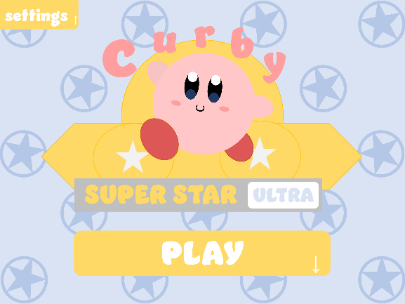
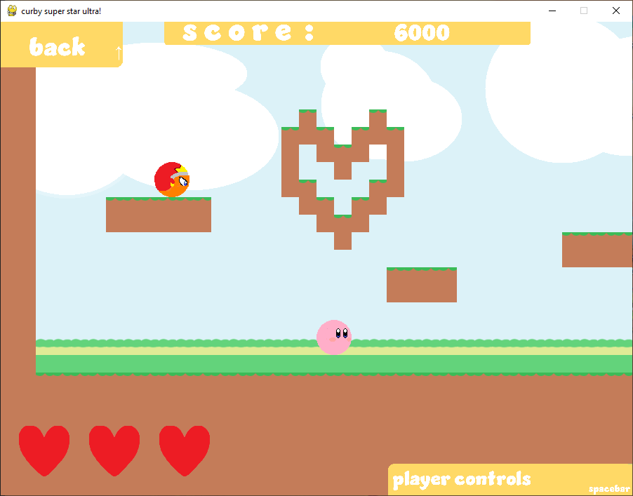
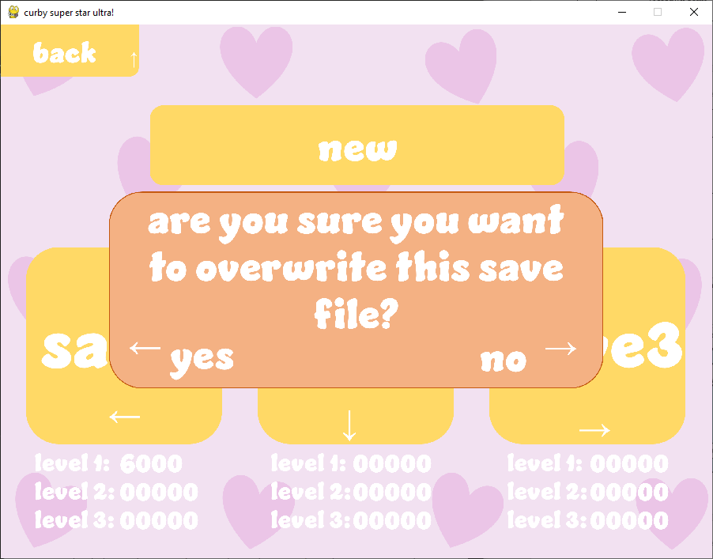
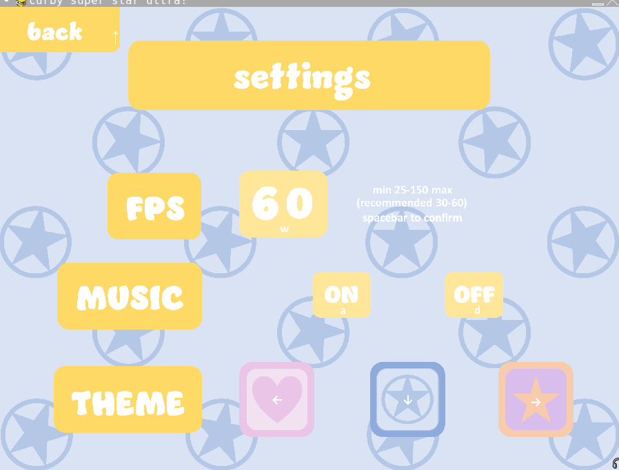

# Curby Super Star Ultra

This game was inspired by Nintendo's "Kirby Super Star Ultra". This was part of my A-level coursework to design, plan and produce a remake of an old game using pygame and I achieved an A.

## Requirements

Install python on your computer:
https://www.python.org/downloads/

Use the package manager [pip](https://pip.pypa.io/en/stable/) to install pygame.

```bash
pip install pygame
```

## Features
- Side-scrolling platformer (with parallax scrolling)
- Menu screens
- Settings page
- Multiple levels
- Multiple save slots
- Custom artwork

## Controls
This game is entirely keyboard-based (doesn't support any mouse input) to mimic the feeling of playing it on a handheld like the original game. This means the menus are a mix of arrow keys and letters, clearly labelled to traverse through.  

Within the game:
- `w` = jump/fly
- `a` = move left
- `s` = move right
- `d` = look
- `up` = back (to menus)
- `left` = relinquish ability
- `right` = eat


## How to play
Select a save file, fly around as curby and try defeat enemies. Levels are completed when curby successfully makes it to the door at the end of the level, however the score of each level is dependent on both the health of kirby and the enemies defeated, so the way to fully complete a level and reach the highest high-score would be to kill all the enemies without taking any damage (high scores for each save are shown on the levels screen).

## File Layout

```
📦project
 ┣ 📂files           <- holds necessary txt files for the game's storage
 ┃ ┣ 🧾level*.txt    <- stores the level layouts
 ┃ ┣ 🧾save*.txt     <- stores the save data
 ┃ ┗ 🧾settings.txt  <- stores the user's settings preferences
 ┣ 📂images          <- holds all the sprites, menu images and backgrounds
 ┣ 📂music           <- holds background music and sound effect wav files
 ┣ 📂music           <- holds screenshots for the readme file
 ┣ 📜main.py         <- the main python file running the curby game
 ┣ 📙readme.md       <- this file describes everything that the game does
```

## Screenshots



